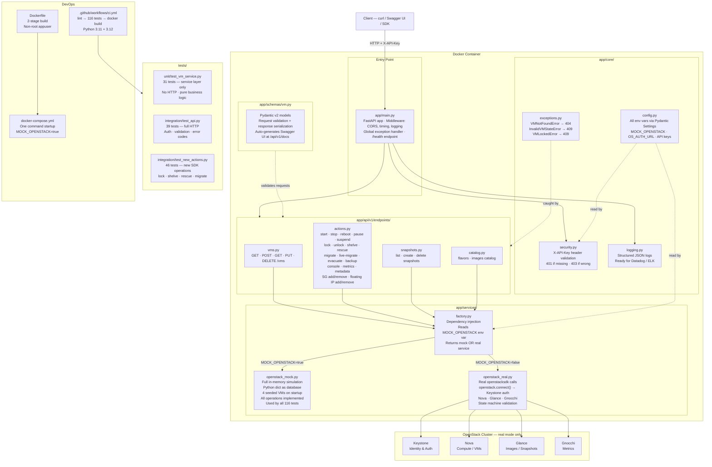

# OpenStack VM Lifecycle Management API

> A production-ready REST API for managing OpenStack virtual machine lifecycle operations.
> Built with **FastAPI · Python 3.11 · openstacksdk · Docker**

[](https://github.com/YOUR_USERNAME/openstack-vm-api/actions)
[](https://www.python.org/)
[](LICENSE)

---

## Table of Contents

1. [Quick Start](#1-quick-start)
2. [API Reference](#2-api-reference)
3. [Sample Requests & Responses](#3-sample-requests--responses)
4. [Architecture](#4-architecture)
5. [Design Decisions](#5-design-decisions)
6. [Project Structure](#6-project-structure)
7. [Configuration](#7-configuration)
8. [Development Guide](#8-development-guide)
9. [Testing](#9-testing)
10. [Deployment](#10-deployment)
11. [Docker](#11-docker)
12. [Roadmap & Backlog](#12-roadmap--backlog)
13. [Assumptions](#13-assumptions)

---

## 1. Quick Start

### Option A — Docker (zero setup, recommended)

```bash
git clone https://github.com/YOUR_USERNAME/openstack-vm-api.git
cd openstack-vm-api
docker-compose up --build
```

- API: http://localhost:8000
- Swagger UI: http://localhost:8000/api/v1/docs
- ReDoc: http://localhost:8000/api/v1/redoc

The default config runs in **mock mode** — no OpenStack cluster needed.
Four seeded VMs are available immediately.

### Option B — Local Python

```bash
python -m venv venv && source venv/bin/activate
pip install -r requirements.txt
cp .env.example .env
uvicorn app.main:app --reload --port 8000
```

### Verify it's running

```bash
curl http://localhost:8000/health
# {"status":"healthy","version":"1.0.0","service":"OpenStack VM Lifecycle API"}

curl http://localhost:8000/api/v1/vms/ -H "X-API-Key: dev-api-key-12345"
# {"vms":[...],"total":4,"page":1,"page_size":20,"has_next":false}
```

---

## 2. API Reference

**Base URL:** `http://localhost:8000/api/v1`
**Auth:** `X-API-Key: <key>` header on every request
**Interactive docs:** http://localhost:8000/api/v1/docs

### VMs — CRUD

| Method   | Path        | Status | Description                     |
|----------|-------------|--------|---------------------------------|
| `GET`    | `/vms`      | 200    | List VMs (paginated, filterable)|
| `POST`   | `/vms`      | 201    | Provision a new VM              |
| `GET`    | `/vms/{id}` | 200    | Get full VM details             |
| `PUT`    | `/vms/{id}` | 200    | Update VM name / metadata       |
| `DELETE` | `/vms/{id}` | 204    | Permanently terminate VM        |

### VMs — Lifecycle Actions

| Method | Path                            | Description                               |
|--------|---------------------------------|-------------------------------------------|
| `POST` | `/vms/{id}/start`               | Start a stopped / suspended VM            |
| `POST` | `/vms/{id}/stop`                | Graceful shutdown (ACPI signal)           |
| `POST` | `/vms/{id}/reboot`              | Soft or hard reboot                       |
| `POST` | `/vms/{id}/suspend`             | Suspend — save RAM state to disk          |
| `POST` | `/vms/{id}/resume`              | Resume from suspended                     |
| `POST` | `/vms/{id}/pause`               | Freeze at hypervisor level                |
| `POST` | `/vms/{id}/unpause`             | Unfreeze                                  |
| `POST` | `/vms/{id}/lock`                | Lock VM — prevents all mutations          |
| `POST` | `/vms/{id}/unlock`              | Unlock VM                                 |
| `POST` | `/vms/{id}/shelve`              | Shelve — free compute, preserve data      |
| `POST` | `/vms/{id}/unshelve`            | Restore shelved VM to ACTIVE              |
| `POST` | `/vms/{id}/rescue`              | Boot into rescue image for OS recovery    |
| `POST` | `/vms/{id}/unrescue`            | Exit rescue mode back to ACTIVE           |
| `POST` | `/vms/{id}/resize`              | Schedule resize to new flavor             |
| `POST` | `/vms/{id}/resize/confirm`      | Confirm a pending resize                  |
| `POST` | `/vms/{id}/migrate`             | Cold-migrate VM to another host           |
| `POST` | `/vms/{id}/live-migrate`        | Live-migrate with zero downtime           |
| `POST` | `/vms/{id}/evacuate`            | Evacuate VM off a failed host             |
| `POST` | `/vms/{id}/backup`              | Scheduled backup with rotation            |
| `GET`  | `/vms/{id}/console`             | Get VNC/SPICE console URL                 |
| `GET`  | `/vms/{id}/metrics`             | CPU, memory, disk, network stats          |
| `GET`  | `/vms/{id}/metadata`            | Get VM metadata key-value pairs           |
| `DELETE` | `/vms/{id}/metadata`          | Delete specific metadata keys             |
| `POST` | `/vms/{id}/security-groups/add` | Add security group to a running VM        |
| `POST` | `/vms/{id}/security-groups/remove` | Remove security group from VM          |
| `POST` | `/vms/{id}/floating-ips/add`    | Attach a floating IP to a VM             |
| `POST` | `/vms/{id}/floating-ips/remove` | Detach a floating IP from a VM           |

### Snapshots

| Method   | Path                            | Description              |
|----------|---------------------------------|--------------------------|
| `GET`    | `/vms/{id}/snapshots`           | List snapshots           |
| `POST`   | `/vms/{id}/snapshots`           | Create snapshot          |
| `DELETE` | `/vms/{id}/snapshots/{snap_id}` | Delete snapshot          |

### Catalog

| Method | Path               | Description               |
|--------|--------------------|---------------------------|
| `GET`  | `/catalog/flavors` | Available compute flavors |
| `GET`  | `/catalog/images`  | Available Glance images   |

### Status Codes

| Code | Meaning                                    |
|------|--------------------------------------------|
| 200  | Success                                    |
| 201  | Created                                    |
| 204  | Deleted (no body)                          |
| 401  | Missing API key                            |
| 403  | Invalid API key                            |
| 404  | VM / snapshot not found                    |
| 409  | VM in wrong state, or VM is locked         |
| 422  | Request schema validation failure          |
| 500  | Internal / OpenStack error                 |

---

## 3. Sample Requests & Responses

### Create a VM

```bash
curl -i -X POST http://localhost:8000/api/v1/vms/ \
  -H "X-API-Key: dev-api-key-12345" \
  -H "Content-Type: application/json" \
  -d '{
    "name": "web-server-01",
    "flavor_id": "m1.small",
    "image_id": "img-ubuntu-22-04",
    "networks": [{"network_id": "net-private"}],
    "key_name": "my-keypair",
    "security_groups": ["default", "web-sg"],
    "metadata": {"env": "production", "team": "platform"}
  }'
```

**Response `201 Created`:**
```json
{
  "id": "a3f8c2d1-1234-5678-abcd-ef0123456789",
  "name": "web-server-01",
  "status": "ACTIVE",
  "flavor_id": "m1.small",
  "image_id": "img-ubuntu-22-04",
  "host": "compute-node-02",
  "availability_zone": "nova",
  "key_name": "my-keypair",
  "security_groups": ["default", "web-sg"],
  "addresses": {
    "private": [{"ip": "10.0.1.15", "version": 4, "type": "fixed"}]
  },
  "metadata": {"env": "production", "team": "platform"},
  "created_at": "2026-03-23T10:30:00+00:00",
  "updated_at": "2026-03-23T10:30:00+00:00",
  "launched_at": "2026-03-23T10:30:00+00:00",
  "progress": 100,
  "task_state": null,
  "power_state": 1
}
```

### Stop / Start a VM

```bash
# Stop
curl -i -X POST http://localhost:8000/api/v1/vms/{id}/stop \
  -H "X-API-Key: dev-api-key-12345"

# Response 200 OK
{
  "success": true,
  "message": "VM stop initiated.",
  "vm_id": "a3f8c2d1-...",
  "action": "stop",
  "request_id": "7c3b9e2a-..."
}
```

### Lock a VM and see it reject mutations

```bash
# Lock
curl -i -X POST http://localhost:8000/api/v1/vms/{id}/lock \
  -H "X-API-Key: dev-api-key-12345" \
  -H "Content-Type: application/json" \
  -d '{"locked_reason": "maintenance window"}'

# Try to stop the locked VM
curl -i -X POST http://localhost:8000/api/v1/vms/{id}/stop \
  -H "X-API-Key: dev-api-key-12345"

# Response 409 Conflict
{"detail": "VM 'a3f8c2d1...' is locked and cannot be modified."}
```

### Resize VM

```bash
# Step 1 — schedule resize
curl -i -X POST http://localhost:8000/api/v1/vms/{id}/resize \
  -H "X-API-Key: dev-api-key-12345" \
  -H "Content-Type: application/json" \
  -d '{"flavor_id": "m1.large"}'

# Step 2 — confirm resize
curl -i -X POST http://localhost:8000/api/v1/vms/{id}/resize/confirm \
  -H "X-API-Key: dev-api-key-12345"
```

### Backup with rotation

```bash
curl -i -X POST http://localhost:8000/api/v1/vms/{id}/backup \
  -H "X-API-Key: dev-api-key-12345" \
  -H "Content-Type: application/json" \
  -d '{"name": "daily-backup", "backup_type": "daily", "rotation": 7}'
```

### Add floating IP

```bash
curl -i -X POST http://localhost:8000/api/v1/vms/{id}/floating-ips/add \
  -H "X-API-Key: dev-api-key-12345" \
  -H "Content-Type: application/json" \
  -d '{"address": "203.0.113.99"}'
```

### Error responses

```bash
# 401 — no API key
curl -i http://localhost:8000/api/v1/vms/
# HTTP/1.1 401 Unauthorized

# 403 — wrong key
curl -i http://localhost:8000/api/v1/vms/ -H "X-API-Key: wrong"
# HTTP/1.1 403 Forbidden

# 404 — VM not found
curl -i http://localhost:8000/api/v1/vms/fake-id -H "X-API-Key: dev-api-key-12345"
# HTTP/1.1 404 Not Found
# {"detail": "VM 'fake-id' not found."}

# 422 — bad request body
curl -i -X POST http://localhost:8000/api/v1/vms/ \
  -H "X-API-Key: dev-api-key-12345" \
  -H "Content-Type: application/json" \
  -d '{}'
# HTTP/1.1 422 Unprocessable Entity
```

> **Tip:** Add `-i` to any curl command to see the HTTP status code in the response headers.

---

## 4. Architecture

### System Overview

```
  Client (curl / Swagger UI / SDK)
         │
         │ HTTP + X-API-Key header
         ▼
  ┌──────────────────────────────────────────────────────────┐
  │                  FastAPI Application                      │
  │                                                           │
  │  app/main.py                                              │
  │  ┌───────────┐  ┌──────────────────┐  ┌───────────────┐  │
  │  │ Auth      │  │   Middleware      │  │ Exception     │  │
  │  │ X-API-Key │  │ CORS · Timing    │  │ Handler       │  │
  │  └───────────┘  │ JSON Logging     │  └───────────────┘  │
  │                 └──────────────────┘                      │
  │                                                           │
  │  app/api/v1/                                              │
  │  ┌──────────────────────────────────────────────────┐    │
  │  │              router.py  /api/v1/                  │    │
  │  │  ┌──────────┐ ┌──────────┐ ┌──────────────────┐  │    │
  │  │  │ vms.py   │ │actions.py│ │snapshots.py      │  │    │
  │  │  │ CRUD     │ │ 24 ops   │ │catalog.py        │  │    │
  │  │  └──────────┘ └──────────┘ └──────────────────┘  │    │
  │  └──────────────────────────────────────────────────┘    │
  │                                                           │
  │  app/services/                                            │
  │  ┌──────────────────────────────────────────────────┐    │
  │  │              factory.py  (DI switch)              │    │
  │  │  ┌──────────────────┐  ┌────────────────────┐    │    │
  │  │  │ openstack_mock   │  │ openstack_real     │    │    │
  │  │  │ Python dict      │  │ openstacksdk       │    │    │
  │  │  │ MOCK=true        │  │ MOCK=false         │    │    │
  │  │  └──────────────────┘  └────────────────────┘    │    │
  │  └──────────────────────────────────────────────────┘    │
  └──────────────────────────────────────────────────────────┘
         │
         │ openstacksdk (real mode only)
         ▼
  ┌─────────────────────────────────────────┐
  │         OpenStack Cluster               │
  │  Keystone · Nova · Glance · Gnocchi     │
  └─────────────────────────────────────────┘
```

### Architecture Diagram (Mermaid)



### VM State Machine

```
                      ┌──────────────────────────────────────┐
                      │              BUILD                    │
                      └──────────────┬───────────────────────┘
                                     │ provisioning complete
                                     ▼
          ┌────stop──── ACTIVE ──────────────── resize ───────┐
          │              │  ▲  ▲                               │
          │      suspend │  │  │ resume                        │
          │              ▼  │  │                               ▼
          │          SUSPENDED  │                      VERIFY_RESIZE
          │                     │                              │
          │    pause  │  │      │ unpause       confirm        │
          │           ▼  │      │                              │
          │         PAUSED ┘    │                      ACTIVE ◄┘
          │
          ▼
       SHUTOFF ──── start ──► ACTIVE
          │
          ▼
       DELETED  (terminal)

Special states:
  ACTIVE  ──lock──►  ACTIVE (locked=true, mutations rejected)
  ACTIVE  ──shelve──► SHELVED
  ACTIVE  ──rescue──► RESCUE
  ACTIVE  ──live-migrate──► ACTIVE (new host, zero downtime)
```

---

## 5. Design Decisions

### Why FastAPI over Flask or Django?
FastAPI was chosen for three reasons. First, async support — OpenStack SDK calls are network I/O, and FastAPI's async handlers mean one slow Nova call does not block other requests. Second, Pydantic integration — request validation, response serialisation, and OpenAPI docs are all generated from the same schema models, no manual maintenance. Third, dependency injection via `Depends()` — plugging in mock vs real service is a one-liner, which is critical for testability.

### Mock / Real toggle
The `MOCK_OPENSTACK` flag means reviewers can run the entire API with `docker-compose up` and no OpenStack cluster. The factory (`services/factory.py`) caches the real service as a singleton via `@lru_cache` so the expensive Keystone auth happens once at startup.

### Domain exceptions → HTTP codes
`VMNotFoundError`, `InvalidVMStateError`, `VMLockedError` are raised in the service layer and caught in endpoint handlers, mapping cleanly to 404/409. Business logic stays out of the HTTP layer and the service layer is independently testable.

### State machine enforcement
`_VALID_TRANSITIONS` in the real service validates VM state before every action. The client gets a meaningful `409 Conflict` immediately rather than waiting for a round-trip to Nova only to get a cryptic error back.

### Versioned API
All endpoints are under `/api/v1/`. When breaking changes are needed a new `/api/v2/` router can be added without disrupting existing clients.

### Structured JSON logging
Every log line is a JSON object with timestamp, level, module, and function name — directly ingestible by Datadog, ELK, or CloudWatch Logs Insights without post-processing.

---

## 6. Project Structure

```
openstack-vm-api/
│
├── app/
│   ├── main.py                      # App factory, middleware, /health endpoint
│   │
│   ├── core/
│   │   ├── config.py                # All env vars via Pydantic Settings
│   │   ├── security.py              # API key auth dependency
│   │   ├── exceptions.py            # VMNotFoundError, VMLockedError, etc.
│   │   └── logging.py               # Structured JSON logger
│   │
│   ├── schemas/vm.py                # All Pydantic v2 request/response models
│   │
│   ├── services/
│   │   ├── factory.py               # DI: reads MOCK_OPENSTACK, returns service
│   │   ├── openstack_mock.py        # In-memory mock — 4 seeded VMs, all ops
│   │   └── openstack_real.py        # Full openstacksdk production service
│   │
│   └── api/v1/
│       ├── router.py                # Assembles all endpoint modules
│       └── endpoints/
│           ├── vms.py               # CRUD: list, create, get, update, delete
│           ├── actions.py           # 24 lifecycle action endpoints
│           ├── snapshots.py         # Snapshot CRUD
│           └── catalog.py           # Flavors + images catalog
│
├── tests/
│   ├── unit/
│   │   └── test_vm_service.py       # 31 service-layer unit tests
│   └── integration/
│       ├── test_api.py              # 39 full HTTP integration tests
│       └── test_new_actions.py      # 46 tests for new SDK operations
│
├── .github/
│   └── workflows/ci.yml             # GitHub Actions CI pipeline
│
├── Dockerfile                       # Multi-stage build, non-root user
├── docker-compose.yml               # One-command local environment
├── requirements.txt                 # All Python dependencies
├── pyproject.toml                   # Project config, pytest settings
├── .env.example                     # Environment variable template
└── .gitignore
```

---

## 7. Configuration

All configuration is via environment variables or a `.env` file.

| Variable | Default | Description |
|---|---|---|
| `MOCK_OPENSTACK` | `true` | `false` to use a real OpenStack cluster |
| `OS_AUTH_URL` | `http://localhost:5000/v3` | Keystone auth endpoint |
| `OS_USERNAME` | `admin` | OpenStack username |
| `OS_PASSWORD` | `admin` | OpenStack password |
| `OS_PROJECT_NAME` | `admin` | Project / tenant name |
| `OS_USER_DOMAIN_NAME` | `Default` | User domain |
| `OS_PROJECT_DOMAIN_NAME` | `Default` | Project domain |
| `OS_REGION_NAME` | `RegionOne` | Region |
| `VALID_API_KEYS` | `["dev-api-key-12345"]` | Accepted API keys |
| `LOG_LEVEL` | `INFO` | `DEBUG`, `INFO`, `WARNING`, `ERROR` |
| `LOG_FORMAT` | `json` | `json` or `text` |
| `DEBUG` | `false` | FastAPI debug mode |

### Mock mode (default — no credentials needed)

```bash
MOCK_OPENSTACK=true
VALID_API_KEYS=["dev-api-key-12345"]
```

### Real OpenStack mode

```bash
MOCK_OPENSTACK=false
OS_AUTH_URL=http://your-openstack-ip:5000/v3
OS_USERNAME=admin
OS_PASSWORD=your-password
OS_PROJECT_NAME=admin
OS_USER_DOMAIN_NAME=Default
OS_PROJECT_DOMAIN_NAME=Default
OS_REGION_NAME=RegionOne
```

---

## 8. Development Guide

```bash
# Setup
python -m venv venv && source venv/bin/activate
pip install -r requirements.txt
cp .env.example .env

# Run with hot-reload
uvicorn app.main:app --reload

# Lint
ruff check app/ tests/

# Format
black app/ tests/
```

---

## 9. Testing

```bash
# All 116 tests
PYTHONPATH=$(pwd) pytest tests/ -v

# Unit tests only (service layer, no HTTP)
PYTHONPATH=$(pwd) pytest tests/unit/ -v

# Integration tests only (full HTTP stack)
PYTHONPATH=$(pwd) pytest tests/integration/ -v

# With coverage report
PYTHONPATH=$(pwd) pytest tests/ --cov=app --cov-report=html
open htmlcov/index.html
```

**Test results:** 116 tests · 72% line coverage · ~8s runtime

| Test file | Tests | What it covers |
|---|---|---|
| `unit/test_vm_service.py` | 31 | Service layer — pure business logic, no HTTP |
| `integration/test_api.py` | 39 | Full HTTP — auth, validation, status codes |
| `integration/test_new_actions.py` | 46 | All new SDK ops — lock, shelve, rescue, migrate |

---

## 10. Deployment

### Docker Compose (local / staging)

```bash
docker-compose up --build -d
docker-compose logs -f
```

### Connect to real OpenStack

```bash
# Edit .env
MOCK_OPENSTACK=false
OS_AUTH_URL=http://your-keystone:5000/v3
OS_USERNAME=myuser
OS_PASSWORD=mypassword
OS_PROJECT_NAME=myproject

docker-compose up --build
```

### Production checklist

- [ ] Replace API key auth with JWT / OAuth2
- [ ] Store credentials in Vault / AWS Secrets Manager
- [ ] Enable Redis for distributed rate limiting
- [ ] Configure TLS termination at nginx / load balancer
- [ ] Set up log aggregation (Datadog / ELK)
- [ ] Add Prometheus `/metrics` endpoint
- [ ] Deploy to Kubernetes (see Sprint 6 in roadmap)

---

## 11. Docker

### What Docker does in this project

The project uses a **two-stage Docker build**:

```
Stage 1 — builder                Stage 2 — runtime
────────────────────             ────────────────────────
python:3.11-slim            →    python:3.11-slim
apt install gcc                  COPY --from=builder /install
pip install all deps             COPY app/ code only
                                 RUN useradd appuser
                                 USER appuser
                                 EXPOSE 8000
                                 CMD uvicorn app.main:app
```

**Why two stages?** The builder stage needs `gcc` and compile tools to install some packages. The runtime stage copies only the final installed packages — no compiler, no build tools. Result: smaller, more secure image.

**Why non-root user?** Running as `root` inside a container is a security risk. `appuser` limits the blast radius if the app is ever compromised.

### docker-compose.yml — one command startup

```bash
docker-compose up --build
```

This single command:
1. Builds the Docker image from the Dockerfile
2. Sets `MOCK_OPENSTACK=true` — no OpenStack cluster needed
3. Exposes port 8000
4. Runs a health check every 30 seconds
5. Restarts automatically if the container crashes

### Without Docker vs With Docker

| Without Docker | With Docker |
|---|---|
| Install Python 3.11 manually | Just install Docker |
| Install all pip packages | `docker-compose up` |
| Set env vars manually | Defined in docker-compose.yml |
| "Works on my machine" | Same image runs everywhere |
| Manual restart on crash | `restart: unless-stopped` |

---

## 12. Roadmap & Backlog

### Sprint 1 — Security & Auth
- [ ] **JWT authentication** — replace API keys with short-lived JWTs from a `/auth/token` endpoint
- [ ] **RBAC** — admin vs viewer roles; viewers can GET but not POST/DELETE
- [ ] **Per-project scoping** — each API key bound to an OpenStack project

### Sprint 2 — Operations
- [ ] **Redis rate limiting** — sliding window, 100 req/min per key (currently in-memory only)
- [ ] **Async task queue** (Celery) — long-running ops return a task ID; client polls `GET /tasks/{id}`
- [ ] **WebSocket status stream** — push VM state transitions to subscribed clients in real time

### Sprint 3 — Expanded Resource Management
- [ ] **Volume management** — create/attach/detach/delete Cinder volumes
- [ ] **Floating IP pools** — allocate and release IPs from Neutron pools
- [ ] **Security group CRUD** — create and manage security groups and rules
- [ ] **Keypair management** — create, import, delete SSH keypairs
- [ ] **Bulk operations** — start/stop multiple VMs in a single request

### Sprint 4 — Observability
- [ ] **Prometheus metrics** — request count, latency histograms, error rates at `/metrics`
- [ ] **OpenTelemetry tracing** — distributed traces across FastAPI → OpenStack SDK
- [ ] **Audit log** — write-operations persisted to Postgres with user, timestamp, diff
- [ ] **Webhook notifications** — POST to a configured URL on VM state changes

### Sprint 5 — Scale & Reliability
- [ ] **Multi-region support** — single API federating across OpenStack regions
- [ ] **Database-backed inventory** — Postgres + SQLAlchemy for cross-cluster queries
- [ ] **Circuit breaker** — fail fast and serve cached state when OpenStack is unreachable
- [ ] **Async VM creation** — return `202 Accepted` with task ID instead of blocking

### Sprint 6 — Kubernetes & Production Deployment
- [ ] **Kubernetes manifests** — Deployment, Service, Ingress, ConfigMap, Secrets
- [ ] **Helm chart** — parameterized K8s deployment for different environments
- [ ] **Horizontal Pod Autoscaler** — scale API pods based on CPU / request load
- [ ] **Rolling deployments** — zero-downtime updates with `maxUnavailable: 0`
- [ ] **Resource limits** — CPU/memory requests and limits per pod
- [ ] **Liveness and readiness probes** — K8s health checking via `/health` endpoint
- [ ] **Ingress with TLS** — HTTPS termination via cert-manager + Let's Encrypt

---

## 13. Assumptions

1. **Authentication simplification** — API key auth is used for the PoC. Production should use OAuth2 / JWT with a proper identity provider.
2. **Mock mode by default** — The prototype runs with an in-memory mock so reviewers need no OpenStack cluster. Set `MOCK_OPENSTACK=false` with valid `OS_*` credentials for a real cluster.
3. **Synchronous SDK calls** — The openstacksdk is synchronous. In production, heavy operations (create, resize) should be dispatched to Celery workers to avoid blocking the web process.
4. **Single-tenant** — The PoC does not enforce project isolation. Multi-tenancy is in Sprint 1 of the roadmap.
5. **Metrics availability** — Real metrics require Gnocchi/Ceilometer deployed on the cluster. The mock returns synthetic data; the real service falls back to zeroes if Gnocchi is unavailable.
6. **No TLS in local dev** — docker-compose exposes port 8000 over plain HTTP. Production should terminate TLS at an nginx ingress or cloud load balancer.

---

## License

MIT © 2026
