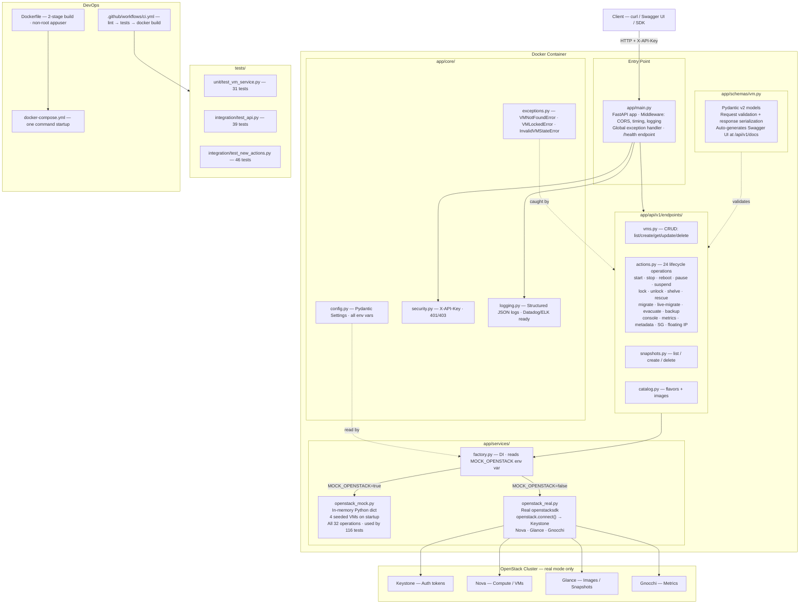

# OpenStack VM Lifecycle Management API

> A production-ready REST API for managing OpenStack virtual machine lifecycle operations.
> Built with **FastAPI · Python 3.11 · openstacksdk · Docker**

[](https://github.com/YOUR_USERNAME/openstack-vm-api/actions)
[](https://www.python.org/)
[](LICENSE)

---

## Table of Contents

1. [Quick Start](#1-quick-start)
2. [API Reference](#2-api-reference)
3. [Sample Requests & Responses](#3-sample-requests--responses)
4. [Architecture](#4-architecture)
5. [Design Decisions](#5-design-decisions)
6. [Project Structure](#6-project-structure)
7. [Configuration](#7-configuration)
8. [Development Guide](#8-development-guide)
9. [Testing](#9-testing)
10. [Deployment](#10-deployment)
11. [Roadmap & Backlog](#11-roadmap--backlog)
12. [Assumptions](#12-assumptions)

---

## 1. Quick Start

### Option A — Docker (zero setup, recommended)

```bash
git clone https://github.com/YOUR_USERNAME/openstack-vm-api.git
cd openstack-vm-api
docker-compose up --build
```

- API: http://localhost:8000
- Swagger UI: http://localhost:8000/api/v1/docs
- ReDoc: http://localhost:8000/api/v1/redoc

The default config runs in **mock mode** — no OpenStack cluster needed.
Four seeded VMs are available immediately.

### Option B — Local Python with uv

```bash
# Install uv if you don't have it
curl -LsSf https://astral.sh/uv/install.sh | sh

# Clone and set up
git clone https://github.com/YOUR_USERNAME/openstack-vm-api.git
cd openstack-vm-api

# Create virtual environment and install all dependencies in one command
uv sync

# Copy environment config
cp .env.example .env

# Run with hot-reload
uv run uvicorn app.main:app --reload --port 8000
```

### Verify it's running

```bash
curl http://localhost:8000/health
# {"status":"healthy","version":"1.0.0","service":"OpenStack VM Lifecycle API"}

curl http://localhost:8000/api/v1/vms/ -H "X-API-Key: dev-api-key-12345"
# {"vms":[...],"total":4,"page":1,"page_size":20,"has_next":false}
```

---

## 2. API Reference

**Base URL:** `http://localhost:8000/api/v1`
**Auth:** `X-API-Key: <key>` header on every request
**Interactive docs:** http://localhost:8000/api/v1/docs

> **Tip:** Add `-i` to any curl command to see the HTTP status code in the response headers.

### VMs — CRUD

| Method   | Path        | Status | Description                     |
|----------|-------------|--------|---------------------------------|
| `GET`    | `/vms`      | 200    | List VMs (paginated, filterable)|
| `POST`   | `/vms`      | 201    | Provision a new VM              |
| `GET`    | `/vms/{id}` | 200    | Get full VM details             |
| `PUT`    | `/vms/{id}` | 200    | Update VM name / metadata       |
| `DELETE` | `/vms/{id}` | 204    | Permanently terminate VM        |

### VMs — Lifecycle Actions

| Method   | Path                               | Description                                |
|----------|------------------------------------|---------------------------------------------|
| `POST`   | `/vms/{id}/start`                  | Start a stopped / suspended VM             |
| `POST`   | `/vms/{id}/stop`                   | Graceful shutdown (ACPI signal)            |
| `POST`   | `/vms/{id}/reboot`                 | Soft or hard reboot                        |
| `POST`   | `/vms/{id}/suspend`                | Suspend — save RAM state to disk           |
| `POST`   | `/vms/{id}/resume`                 | Resume from suspended                      |
| `POST`   | `/vms/{id}/pause`                  | Freeze at hypervisor level                 |
| `POST`   | `/vms/{id}/unpause`                | Unfreeze                                   |
| `POST`   | `/vms/{id}/lock`                   | Lock VM — prevents all mutations           |
| `POST`   | `/vms/{id}/unlock`                 | Unlock VM                                  |
| `POST`   | `/vms/{id}/shelve`                 | Shelve — free compute, preserve data       |
| `POST`   | `/vms/{id}/unshelve`               | Restore shelved VM to ACTIVE               |
| `POST`   | `/vms/{id}/rescue`                 | Boot into rescue image for OS recovery     |
| `POST`   | `/vms/{id}/unrescue`               | Exit rescue mode back to ACTIVE            |
| `POST`   | `/vms/{id}/resize`                 | Schedule resize to new flavor              |
| `POST`   | `/vms/{id}/resize/confirm`         | Confirm a pending resize                   |
| `POST`   | `/vms/{id}/migrate`                | Cold-migrate VM to another host            |
| `POST`   | `/vms/{id}/live-migrate`           | Live-migrate with zero downtime            |
| `POST`   | `/vms/{id}/evacuate`               | Evacuate VM off a failed host              |
| `POST`   | `/vms/{id}/backup`                 | Scheduled backup with rotation             |
| `GET`    | `/vms/{id}/console`                | Get VNC/SPICE console URL                  |
| `GET`    | `/vms/{id}/metrics`                | CPU, memory, disk, network stats           |
| `GET`    | `/vms/{id}/metadata`               | Get VM metadata key-value pairs            |
| `DELETE` | `/vms/{id}/metadata`               | Delete specific metadata keys              |
| `POST`   | `/vms/{id}/security-groups/add`    | Add security group to a running VM         |
| `POST`   | `/vms/{id}/security-groups/remove` | Remove security group from VM              |
| `POST`   | `/vms/{id}/floating-ips/add`       | Attach a floating IP to a VM              |
| `POST`   | `/vms/{id}/floating-ips/remove`    | Detach a floating IP from a VM            |

### Snapshots

| Method   | Path                            | Description              |
|----------|---------------------------------|--------------------------|
| `GET`    | `/vms/{id}/snapshots`           | List snapshots           |
| `POST`   | `/vms/{id}/snapshots`           | Create snapshot          |
| `DELETE` | `/vms/{id}/snapshots/{snap_id}` | Delete snapshot          |

### Catalog

| Method | Path               | Description               |
|--------|--------------------|---------------------------|
| `GET`  | `/catalog/flavors` | Available compute flavors |
| `GET`  | `/catalog/images`  | Available Glance images   |

### Status Codes

| Code | Meaning                                    |
|------|--------------------------------------------|
| 200  | Success                                    |
| 201  | Created                                    |
| 204  | Deleted (no body)                          |
| 401  | Missing API key                            |
| 403  | Invalid API key                            |
| 404  | VM / snapshot not found                    |
| 409  | VM in wrong state, or VM is locked         |
| 422  | Request schema validation failure          |
| 500  | Internal / OpenStack error                 |

---

## 3. Sample Requests & Responses

### Create a VM

```bash
curl -i -X POST http://localhost:8000/api/v1/vms/ \
  -H "X-API-Key: dev-api-key-12345" \
  -H "Content-Type: application/json" \
  -d '{
    "name": "web-server-01",
    "flavor_id": "m1.small",
    "image_id": "img-ubuntu-22-04",
    "networks": [{"network_id": "net-private"}],
    "key_name": "my-keypair",
    "security_groups": ["default", "web-sg"],
    "metadata": {"env": "production", "team": "platform"}
  }'
```

**Response `201 Created`:**
```json
{
  "id": "a3f8c2d1-1234-5678-abcd-ef0123456789",
  "name": "web-server-01",
  "status": "ACTIVE",
  "flavor_id": "m1.small",
  "image_id": "img-ubuntu-22-04",
  "host": "compute-node-02",
  "key_name": "my-keypair",
  "security_groups": ["default", "web-sg"],
  "addresses": {
    "private": [{"ip": "10.0.1.15", "version": 4, "type": "fixed"}]
  },
  "metadata": {"env": "production", "team": "platform"},
  "created_at": "2026-03-23T10:30:00+00:00",
  "launched_at": "2026-03-23T10:30:00+00:00",
  "progress": 100,
  "power_state": 1
}
```

### Available mock image IDs

| `image_id` | OS |
|---|---|
| `img-ubuntu-22-04` | Ubuntu 22.04 LTS |
| `img-centos-9` | CentOS Stream 9 |
| `img-debian-12` | Debian 12 Bookworm |

### Available mock flavor IDs

| `flavor_id` | vCPUs | RAM | Disk |
|---|---|---|---|
| `m1.tiny` | 1 | 512 MB | 1 GB |
| `m1.small` | 1 | 2 GB | 20 GB |
| `m1.medium` | 2 | 4 GB | 40 GB |
| `m1.large` | 4 | 8 GB | 80 GB |
| `m1.xlarge` | 8 | 16 GB | 160 GB |

### Stop / Start

```bash
curl -i -X POST http://localhost:8000/api/v1/vms/{id}/stop \
  -H "X-API-Key: dev-api-key-12345"
# HTTP/1.1 200 OK
# {"success": true, "message": "VM stop initiated.", "action": "stop", ...}
```

### Lock a VM — prevents mutations

```bash
# Lock
curl -i -X POST http://localhost:8000/api/v1/vms/{id}/lock \
  -H "X-API-Key: dev-api-key-12345" \
  -H "Content-Type: application/json" \
  -d '{"locked_reason": "maintenance window"}'

# Try to stop while locked
curl -i -X POST http://localhost:8000/api/v1/vms/{id}/stop \
  -H "X-API-Key: dev-api-key-12345"
# HTTP/1.1 409 Conflict
# {"detail": "VM '...' is locked and cannot be modified."}
```

### Resize VM (two-step)

```bash
# Step 1 — schedule
curl -i -X POST http://localhost:8000/api/v1/vms/{id}/resize \
  -H "X-API-Key: dev-api-key-12345" \
  -H "Content-Type: application/json" \
  -d '{"flavor_id": "m1.large"}'

# Step 2 — confirm
curl -i -X POST http://localhost:8000/api/v1/vms/{id}/resize/confirm \
  -H "X-API-Key: dev-api-key-12345"
```

### Backup with rotation

```bash
curl -i -X POST http://localhost:8000/api/v1/vms/{id}/backup \
  -H "X-API-Key: dev-api-key-12345" \
  -H "Content-Type: application/json" \
  -d '{"name": "daily-backup", "backup_type": "daily", "rotation": 7}'
```

### Error responses

```bash
# 401 — no key
curl -i http://localhost:8000/api/v1/vms/

# 403 — wrong key
curl -i http://localhost:8000/api/v1/vms/ -H "X-API-Key: wrong"

# 404 — not found
curl -i http://localhost:8000/api/v1/vms/fake-id \
  -H "X-API-Key: dev-api-key-12345"
# {"detail": "VM 'fake-id' not found."}

# 422 — bad body
curl -i -X POST http://localhost:8000/api/v1/vms/ \
  -H "X-API-Key: dev-api-key-12345" \
  -H "Content-Type: application/json" \
  -d '{}'
```

---

## 4. Architecture

### System Overview

```
  Client (curl / Swagger UI / SDK)
         │
         │ HTTP + X-API-Key header
         ▼
  ┌──────────────────────────────────────────────────────────┐
  │                  FastAPI Application                      │
  │                                                           │
  │  app/main.py                                              │
  │  ┌───────────┐  ┌──────────────────┐  ┌───────────────┐  │
  │  │ Auth      │  │   Middleware      │  │ Exception     │  │
  │  │ X-API-Key │  │ CORS · Timing    │  │ Handler       │  │
  │  └───────────┘  │ JSON Logging     │  └───────────────┘  │
  │                 └──────────────────┘                      │
  │                                                           │
  │  app/api/v1/                                              │
  │  ┌──────────────────────────────────────────────────┐    │
  │  │  vms.py · actions.py · snapshots.py · catalog.py │    │
  │  └──────────────────────────────────────────────────┘    │
  │                                                           │
  │  app/services/                                            │
  │  ┌──────────────────────────────────────────────────┐    │
  │  │            factory.py  (DI switch)                │    │
  │  │  ┌──────────────────┐  ┌────────────────────┐    │    │
  │  │  │ openstack_mock   │  │ openstack_real     │    │    │
  │  │  │ Python dict      │  │ openstacksdk       │    │    │
  │  │  │ MOCK=true        │  │ MOCK=false         │    │    │
  │  │  └──────────────────┘  └────────────────────┘    │    │
  │  └──────────────────────────────────────────────────┘    │
  └──────────────────────────────────────────────────────────┘
         │
         │ openstacksdk (real mode only)
         ▼
  ┌──────────────────────────────────────────────────────────┐
  │  OpenStack Cluster                                        │
  │  Keystone · Nova · Glance · Neutron · Gnocchi             │
  └──────────────────────────────────────────────────────────┘
```

### Architecture Diagram (Mermaid)



### VM State Machine

```
                      ┌──────────────────────────────────────┐
                      │              BUILD                    │
                      └──────────────┬───────────────────────┘
                                     │
                                     ▼
          ┌────stop──── ACTIVE ─────────────── resize ────────┐
          │              │  ▲  ▲                               │
          │      suspend │  │  │ resume                        │
          │              ▼  │  │                               ▼
          │          SUSPENDED  │                      VERIFY_RESIZE
          │    pause  │  │  │ unpause       confirm            │
          │           ▼  │  │                                  │
          │         PAUSED ┘  │                        ACTIVE ◄┘
          │
          ▼
       SHUTOFF ──── start ──► ACTIVE

  ACTIVE ──shelve──► SHELVED ──unshelve──► ACTIVE
  ACTIVE ──rescue──► RESCUE  ──unrescue──► ACTIVE
  ACTIVE ──lock───► ACTIVE (locked=true, all mutations rejected)
  ACTIVE ──live-migrate──► ACTIVE (moved to new host, zero downtime)
  ACTIVE/SHUTOFF ──migrate──► VERIFY_RESIZE (confirm to finalize)
```

---

## 5. Design Decisions

**Why FastAPI over Flask or Django?**
FastAPI was chosen for async support (OpenStack calls are network I/O), Pydantic integration (request validation, response serialisation, and OpenAPI docs all from one model), and dependency injection via `Depends()` which makes swapping mock vs real service a one-liner.

**Mock / Real toggle**
The `MOCK_OPENSTACK` flag means anyone can run the full API with `docker-compose up` without an OpenStack cluster. The factory (`services/factory.py`) caches the real service as a singleton via `@lru_cache` so the Keystone auth happens once at startup.

**Domain exceptions → HTTP codes**
`VMNotFoundError`, `InvalidVMStateError`, `VMLockedError` are raised in the service layer and caught in endpoint handlers. Business logic stays out of the HTTP layer and the service layer is independently testable.

**State machine enforcement**
`_VALID_TRANSITIONS` in the real service validates VM state before every action. The client gets a clear `409 Conflict` immediately rather than a round-trip to Nova returning a cryptic error.

**Versioned API**
All endpoints are under `/api/v1/`. When breaking changes are needed, a new `/api/v2/` router can be added without disrupting existing clients.

**Structured JSON logging**
Every log line is a JSON object with timestamp, level, module, and function name — directly ingestible by Datadog, ELK, or CloudWatch Logs Insights without post-processing.

---

## 6. Project Structure

```
openstack-vm-api/
│
├── app/
│   ├── main.py                      # App factory, middleware, /health endpoint
│   ├── core/
│   │   ├── config.py                # All env vars via Pydantic Settings
│   │   ├── security.py              # API key auth dependency
│   │   ├── exceptions.py            # Domain exceptions
│   │   └── logging.py               # Structured JSON logger
│   ├── schemas/vm.py                # All Pydantic v2 request/response models
│   ├── services/
│   │   ├── factory.py               # DI: reads MOCK_OPENSTACK, returns service
│   │   ├── openstack_mock.py        # In-memory mock — 4 seeded VMs, all ops
│   │   └── openstack_real.py        # Full openstacksdk production service
│   └── api/v1/
│       ├── router.py                # Assembles all endpoint modules
│       └── endpoints/
│           ├── vms.py               # CRUD
│           ├── actions.py           # 24 lifecycle action endpoints
│           ├── snapshots.py         # Snapshot CRUD
│           └── catalog.py           # Flavors + images
│
├── tests/
│   ├── unit/test_vm_service.py      # 31 service-layer unit tests
│   └── integration/
│       ├── test_api.py              # 39 full HTTP integration tests
│       └── test_new_actions.py      # 46 tests for new SDK operations
│
├── .github/workflows/ci.yml         # GitHub Actions CI pipeline
├── Dockerfile                       # Multi-stage build, non-root user
├── docker-compose.yml               # One-command local environment
├── pyproject.toml                   # Project config, uv + pytest settings
├── requirements.txt                 # Python dependencies
├── .env.example                     # Environment variable template
└── .gitignore
```

---

## 7. Configuration

All configuration is via environment variables or a `.env` file.

| Variable | Default | Description |
|---|---|---|
| `MOCK_OPENSTACK` | `true` | `false` to connect to a real OpenStack cluster |
| `OS_AUTH_URL` | `http://localhost:5000/v3` | Keystone auth endpoint |
| `OS_USERNAME` | `admin` | OpenStack username |
| `OS_PASSWORD` | `admin` | OpenStack password |
| `OS_PROJECT_NAME` | `admin` | Project / tenant name |
| `OS_USER_DOMAIN_NAME` | `Default` | User domain |
| `OS_PROJECT_DOMAIN_NAME` | `Default` | Project domain |
| `OS_REGION_NAME` | `RegionOne` | Region |
| `VALID_API_KEYS` | `["dev-api-key-12345"]` | Accepted API keys (JSON list) |
| `LOG_LEVEL` | `INFO` | `DEBUG`, `INFO`, `WARNING`, `ERROR` |
| `LOG_FORMAT` | `json` | `json` or `text` |
| `DEBUG` | `false` | FastAPI debug mode |

### Mock mode (default — zero credentials needed)

```bash
MOCK_OPENSTACK=true
VALID_API_KEYS=["dev-api-key-12345"]
```

### Real OpenStack mode

```bash
MOCK_OPENSTACK=false
OS_AUTH_URL=http://your-openstack-ip:5000/v3
OS_USERNAME=admin
OS_PASSWORD=your-password
OS_PROJECT_NAME=admin
OS_USER_DOMAIN_NAME=Default
OS_PROJECT_DOMAIN_NAME=Default
OS_REGION_NAME=RegionOne
```

---

## 8. Development Guide

This project uses [**uv**](https://docs.astral.sh/uv/) — a fast Python package and project manager.

### Setup

```bash
# 1. Install uv (if not already installed)
curl -LsSf https://astral.sh/uv/install.sh | sh

# 2. Clone the repo
git clone https://github.com/YOUR_USERNAME/openstack-vm-api.git
cd openstack-vm-api

# 3. Create virtual environment and install all dependencies
uv sync

# 4. Copy environment config
cp .env.example .env
```

### Run

```bash
# Hot-reload development server
uv run uvicorn app.main:app --reload

# Or activate the venv and run directly
source .venv/bin/activate
uvicorn app.main:app --reload
```

### Common uv commands

```bash
# Add a new dependency
uv add fastapi

# Add a dev-only dependency
uv add --dev pytest

# Run any command inside the project venv
uv run pytest tests/

# Lint
uv run ruff check app/ tests/

# Format
uv run black app/ tests/

# Show installed packages
uv pip list
```

### Why uv?
uv is 10-100x faster than pip for installs, automatically manages the virtual environment, and reads dependencies from `pyproject.toml`. A single `uv sync` replaces the old `python -m venv venv && pip install -r requirements.txt` workflow.

---

## 9. Testing

```bash
# All 116 tests
PYTHONPATH=$(pwd) uv run pytest tests/ -v

# Unit tests only (service layer, no HTTP)
PYTHONPATH=$(pwd) uv run pytest tests/unit/ -v

# Integration tests only (full HTTP stack)
PYTHONPATH=$(pwd) uv run pytest tests/integration/ -v

# With coverage report
PYTHONPATH=$(pwd) uv run pytest tests/ --cov=app --cov-report=html
open htmlcov/index.html
```

**Test results:** 116 tests · 72% line coverage · ~8s runtime

| Test file | Tests | What it covers |
|---|---|---|
| `unit/test_vm_service.py` | 31 | Service layer — pure business logic, no HTTP |
| `integration/test_api.py` | 39 | Full HTTP — auth, validation, status codes |
| `integration/test_new_actions.py` | 46 | All new SDK ops — lock, shelve, rescue, migrate |

---

## 10. Deployment

### Docker Compose (local / staging)

```bash
docker-compose up --build -d
docker-compose logs -f
```

### Connect to real OpenStack

```bash
# Edit .env
MOCK_OPENSTACK=false
OS_AUTH_URL=http://your-keystone:5000/v3
OS_USERNAME=myuser
OS_PASSWORD=mypassword
OS_PROJECT_NAME=myproject

docker-compose up --build
```

### Production checklist

- [ ] Replace API key auth with JWT / OAuth2
- [ ] Store credentials in Vault / AWS Secrets Manager
- [ ] Enable Redis for distributed rate limiting
- [ ] Configure TLS termination at nginx / load balancer
- [ ] Set up log aggregation (Datadog / ELK)
- [ ] Add Prometheus `/metrics` endpoint
- [ ] Deploy to Kubernetes (see Sprint 6 in roadmap)

---

## 11. Roadmap & Backlog

### Sprint 1 — Security & Auth
- [ ] **JWT authentication** — replace API keys with short-lived JWTs from `/auth/token`
- [ ] **RBAC** — admin vs viewer roles; viewers can GET but not POST/DELETE
- [ ] **Per-project scoping** — each API key bound to an OpenStack project

### Sprint 2 — Operations & Async
- [ ] **Redis rate limiting** — sliding window, 100 req/min per key (currently in-memory only)
- [ ] **Async task queue** (Celery) — long-running ops (create, resize) return a task ID; client polls `GET /tasks/{id}`
- [ ] **`POST /vms` returns `202 Accepted`** with task ID instead of blocking until ACTIVE
- [ ] **WebSocket status stream** — push VM state transitions to clients in real time

### Sprint 3 — Expanded Resource Management
- [ ] **Volume management** — create/attach/detach/delete Cinder volumes
- [ ] **Floating IP pools** — allocate and release IPs from Neutron pools
- [ ] **Security group CRUD** — create/delete groups and rules
- [ ] **Keypair management** — create, import, delete SSH keypairs
- [ ] **Bulk operations** — start/stop multiple VMs in a single request

### Sprint 4 — Observability
- [ ] **Prometheus metrics** — request count, latency histograms, error rates at `/metrics`
- [ ] **OpenTelemetry tracing** — distributed traces across FastAPI → OpenStack SDK
- [ ] **Audit log** — write-operations persisted to Postgres with user, timestamp, diff
- [ ] **Webhook notifications** — POST to a configured URL on VM state changes

### Sprint 5 — Real OpenStack Integration (Full Production)

The current prototype uses a mock service for local development. The long-term goal is to **migrate entirely to real OpenStack** using `openstack_real.py` backed by a live cluster. This sprint covers all remaining SDK operations from the [official openstacksdk compute documentation](https://docs.openstack.org/openstacksdk/latest/user/proxies/compute.html) that are not yet exposed as FastAPI endpoints:

**Availability Zone operations**
- [ ] `GET /availability-zones` — `conn.compute.availability_zones()` — list all AZs
- [ ] `GET /availability-zones/detail` — `conn.compute.availability_zones(details=True)` — list AZs with full host/service detail

**Flavor operations**
- [ ] `POST /flavors` — `conn.compute.create_flavor()` — create a custom flavor
- [ ] `DELETE /flavors/{id}` — `conn.compute.delete_flavor()` — delete a flavor
- [ ] `GET /flavors/{id}/extra-specs` — `conn.compute.get_flavor_extra_specs()` — get extra specs
- [ ] `POST /flavors/{id}/extra-specs` — `conn.compute.update_flavor_extra_specs()` — set extra specs

**Keypair operations**
- [ ] `GET /keypairs` — `conn.compute.keypairs()` — list keypairs
- [ ] `POST /keypairs` — `conn.compute.create_keypair()` — create or import keypair
- [ ] `GET /keypairs/{name}` — `conn.compute.get_keypair()` — get keypair details
- [ ] `DELETE /keypairs/{name}` — `conn.compute.delete_keypair()` — delete keypair

**Server Group operations**
- [ ] `GET /server-groups` — `conn.compute.server_groups()` — list server groups
- [ ] `POST /server-groups` — `conn.compute.create_server_group()` — create server group (affinity/anti-affinity)
- [ ] `GET /server-groups/{id}` — `conn.compute.get_server_group()` — get server group
- [ ] `DELETE /server-groups/{id}` — `conn.compute.delete_server_group()` — delete server group

**Aggregate operations (admin)**
- [ ] `GET /aggregates` — `conn.compute.aggregates()` — list host aggregates
- [ ] `POST /aggregates` — `conn.compute.create_aggregate()` — create aggregate
- [ ] `POST /aggregates/{id}/add-host` — `conn.compute.add_host_to_aggregate()` — add host
- [ ] `POST /aggregates/{id}/remove-host` — `conn.compute.remove_host_from_aggregate()` — remove host

**Quota operations (admin)**
- [ ] `GET /quotas/{project_id}` — `conn.compute.get_quota_set()` — get project quotas
- [ ] `PUT /quotas/{project_id}` — `conn.compute.update_quota_set()` — update quotas
- [ ] `DELETE /quotas/{project_id}` — `conn.compute.revert_quota_set()` — reset to defaults

**Console / VNC operations**
- [ ] `POST /vms/{id}/console-output` — `conn.compute.get_server_console_output()` — get console log text
- [ ] `conn.compute.wait_for_server()` — poll until VM reaches target state (used internally for async flows)

**Fixed IP operations**
- [ ] `POST /vms/{id}/fixed-ips/add` — `conn.compute.add_fixed_ip_to_server()` — assign fixed IP from network
- [ ] `POST /vms/{id}/fixed-ips/remove` — `conn.compute.remove_fixed_ip_from_server()` — remove fixed IP

**Real OpenStack migration tasks**
- [ ] Set `MOCK_OPENSTACK=false` as the new default
- [ ] Integration tests against a DevStack or live cluster (not just mock)
- [ ] `conn.compute.wait_for_server()` used in all create/resize flows
- [ ] Replace synthetic metrics with real Gnocchi/Ceilometer data
- [ ] Validate all endpoint responses against real Nova API responses

---


## License

MIT © 2026